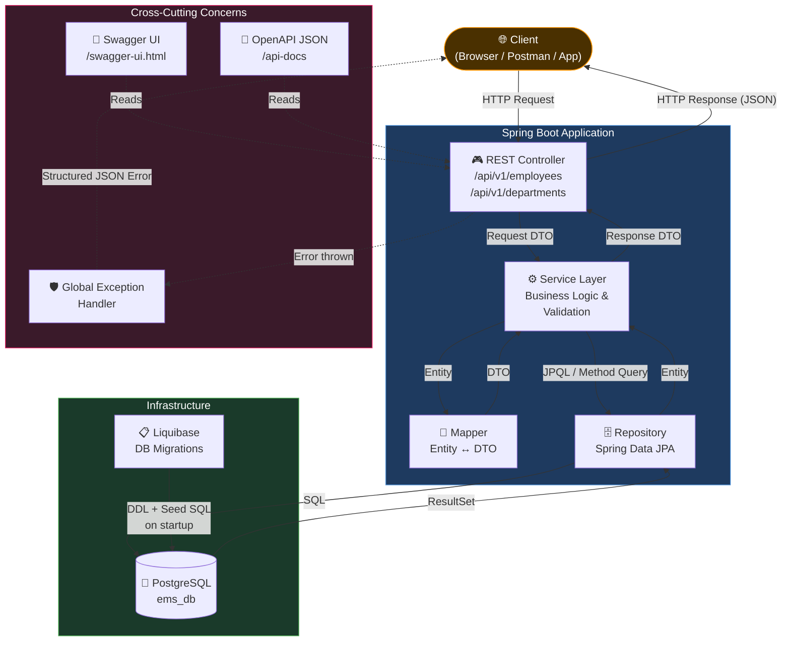
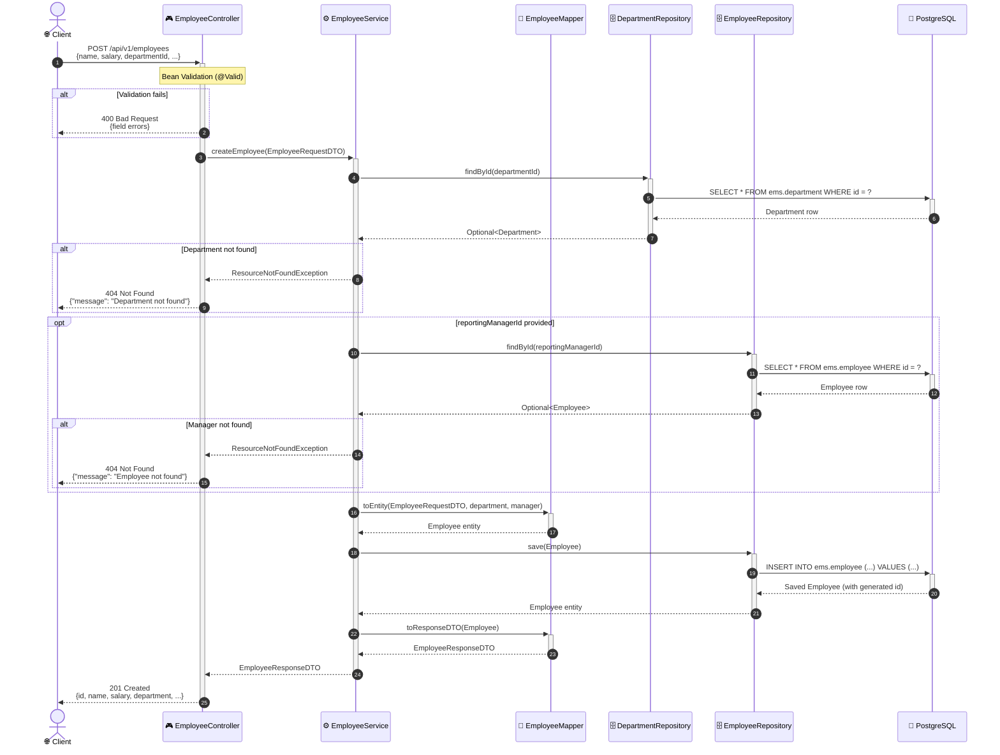

# Employee Management System

A production-ready **Spring Boot 3.x** REST API backend for managing employees and departments within an organization.

---

## Technology Stack

| Component         | Technology                    |
|-------------------|-------------------------------|
| Language          | Java 21                       |
| Framework         | Spring Boot 3.3.5             |
| Build Tool        | Gradle 8.12                   |
| Database          | PostgreSQL                    |
| ORM               | Spring Data JPA (Hibernate)   |
| DB Migrations     | Liquibase                     |
| Utilities         | Lombok                        |
| API Documentation | SpringDoc OpenAPI (Swagger)   |
| Testing           | JUnit 5, Mockito              |

---

## Architecture & Flow Diagrams

### Application Layer Flow



---

### API Request Sequence — Create Employee



---

## Project Structure

```
src/main/java/com/company/ems/
├── config/                     # OpenAPI / Swagger config
├── controller/                 # REST controllers
├── dto/
│   ├── request/                # Request DTOs with Bean Validation
│   └── response/               # Response DTOs
├── entity/                     # JPA entities (Employee, Department)
├── exception/                  # Custom exceptions + Global handler
├── mapper/                     # Manual entity ↔ DTO mappers
├── repository/                 # Spring Data JPA repositories
└── service/
    └── impl/                   # Service implementations

src/main/resources/
├── application.yml             # Base configuration
├── application-local.yml       # Local profile (verbose SQL logging)
├── application-dev.yml         # Dev profile (env vars)
└── db/changelog/
    ├── db.changelog-master.xml # Liquibase master changelog
    └── sql/
        ├── V1__create_schema.sql
        ├── V2__create_department_table.sql
        ├── V3__create_employee_table.sql
        ├── V4__add_department_head.sql
        ├── V5__seed_departments.sql
        ├── V6__seed_employees.sql
        └── V7__update_department_heads.sql
```

---

## Database Setup

### Prerequisites
- PostgreSQL 14+ installed and running

### Create the database

```sql
CREATE DATABASE ems_db;
```

> **Note:** The `ems` schema, all tables, indexes, and seed data are created automatically by Liquibase when the application starts. You only need an empty database.

### Default connection settings (local profile)

| Setting  | Value       |
|----------|-------------|
| Host     | localhost   |
| Port     | 5432        |
| Database | ems_db      |
| Username | postgres    |
| Password | root    |

To override, set environment variables: `DATASOURCE_URL`, `DATASOURCE_USERNAME`, `DATASOURCE_PASSWORD`.

---

## Build Instructions

```bash
# Build the project (skipping tests)
./gradlew build -x test

# Build and run all tests
./gradlew build
```

---

## Run Instructions

### Local profile (recommended for development)

```bash
./gradlew bootRun --args='--spring.profiles.active=local'
```

### Dev profile

```bash
export DATASOURCE_URL=jdbc:postgresql://your-host:5432/ems_db
export DATASOURCE_USERNAME=your_user
export DATASOURCE_PASSWORD=your_password

./gradlew bootRun --args='--spring.profiles.active=dev'
```

### Using the JAR

```bash
java -jar build/libs/employee-management-system-1.0.0.jar --spring.profiles.active=local
```

The application starts on **http://localhost:8080**.

---

## API Documentation

For complete API endpoint details including cURL commands, query parameters, request bodies, and sample JSON responses, see **[API_DOCUMENTATION.md](file:///d:/Learning/Projects/Employee-Management-System/API_DOCUMENTATION.md)**.

Once the application is running, you can also access interactive Swagger UI or import the Postman collection:

- **Swagger UI:** http://localhost:8080/swagger-ui.html
- **OpenAPI JSON:** http://localhost:8080/api-docs
- **Postman Collection:** [postman/Employee Management System.postman_collection.json](file:///d:/Learning/Projects/Employee-Management-System/postman/Employee%20Management%20System.postman_collection.json)

---

## API Reference

### Base path: `/api/v1`

### Employee Endpoints

| Method | Endpoint                          | Description                                   |
|--------|-----------------------------------|-----------------------------------------------|
| POST   | `/employees`                      | Create a new employee                         |
| PUT    | `/employees/{id}`                 | Update an employee                            |
| GET    | `/employees/{id}`                 | Get employee by ID                            |
| GET    | `/employees`                      | Get all employees (paginated)                 |
| GET    | `/employees?lookup=true`          | Get employee id+name list (paginated)         |
| PATCH  | `/employees/{id}/department`      | Update employee's department                  |
| GET    | `/employees/{id}/reporting-chain` | Get full reporting hierarchy                  |

### Department Endpoints

| Method | Endpoint                          | Description                                   |
|--------|-----------------------------------|-----------------------------------------------|
| POST   | `/departments`                    | Create a new department                       |
| PUT    | `/departments/{id}`               | Update a department                           |
| DELETE | `/departments/{id}`               | Delete department (fails if has employees)    |
| GET    | `/departments/{id}`               | Get department by ID                          |
| GET    | `/departments/{id}?expand=employee`| Get department + employee list (paginated)   |
| GET    | `/departments`                    | Get all departments (paginated)               |
| GET    | `/departments/{id}/analytics`     | Get department analytics                      |

### Pagination

All collection endpoints support:
- `page` — page number (default: 0)
- `size` — page size (default: 20)
- `sort` — sort field and direction (e.g., `sort=name,asc`)

Example: `GET /api/v1/employees?page=0&size=10&sort=name,asc`

---

## Sample Requests & Responses

### Create Employee

```json
POST /api/v1/employees
{
  "name": "Jane Smith",
  "dateOfBirth": "1990-05-14",
  "salary": 95000.00,
  "departmentId": 1,
  "address": "123 Main St, New York, NY 10001",
  "roleTitle": "Software Engineer",
  "joiningDate": "2024-01-15",
  "yearlyBonusPercentage": 12.00,
  "reportingManagerId": 5
}
```

### Create Department

```json
POST /api/v1/departments
{
  "name": "Product Management",
  "creationDate": "2024-01-01",
  "departmentHeadId": 2
}
```

### Reporting Chain Response

```json
GET /api/v1/employees/8/reporting-chain
[
  { "id": 8, "name": "Henry Thomas",   "roleTitle": "Software Engineer" },
  { "id": 6, "name": "Frank Anderson", "roleTitle": "Senior Software Engineer" },
  { "id": 5, "name": "Eve Martinez",   "roleTitle": "Engineering Director" },
  { "id": 2, "name": "Bob Williams",   "roleTitle": "VP of Engineering" },
  { "id": 1, "name": "Alice Johnson",  "roleTitle": "Chief Executive Officer" }
]
```

### Department Analytics Response

```json
GET /api/v1/departments/1/analytics
{
  "departmentId": 1,
  "employeeCount": 14,
  "averageSalary": 99071.43,
  "totalSalary": 1387000.00
}
```

### Error Response

```json
{
  "timestamp": "2026-08-19T10:30:00",
  "status": 404,
  "error": "Not Found",
  "message": "Employee with id '999' was not found",
  "path": "/api/v1/employees/999"
}
```

---

## Liquibase Details

Liquibase automatically manages all DDL and seed data on application startup.

### Changelog order

| Changeset | File                           | Description                                     |
|-----------|--------------------------------|-------------------------------------------------|
| 1         | V1__create_schema.sql          | Creates the `ems` schema                        |
| 2         | V2__create_department_table.sql| Creates `department` table                      |
| 3         | V3__create_employee_table.sql  | Creates `employee` table with indexes           |
| 4         | V4__add_department_head.sql    | Adds `department_head_id` FK to department      |
| 5         | V5__seed_departments.sql       | Seeds 3 departments                             |
| 6         | V6__seed_employees.sql         | Seeds 25 employees with full hierarchy          |
| 7         | V7__update_department_heads.sql| Sets department heads                           |

Liquibase tracks applied changesets in the `public.DATABASECHANGELOG` table.

To reset and re-run all migrations (⚠️ drops all data):
```sql
DROP SCHEMA ems CASCADE;
DELETE FROM public.databasechangelog;
DELETE FROM public.databasechangeloglock;
```
Then restart the application.

---

## Running Tests

```bash
# Run all unit tests
./gradlew test

# Run tests with detailed output
./gradlew test --info

# View test report (HTML)
open build/reports/tests/test/index.html
```

---

## Seed Data Overview

| Department    | Head           | Employees |
|---------------|----------------|-----------|
| Engineering   | Bob Williams   | 14        |
| Human Resources | David Wilson | 5         |
| Finance       | Carol Davis    | 6         |

### Reporting Hierarchy

```
Alice Johnson (CEO)
├── Bob Williams (VP of Engineering)
│   ├── Eve Martinez (Engineering Director)
│   │   ├── Frank Anderson (Senior Software Engineer)
│   │   │   ├── Henry Thomas (Software Engineer)
│   │   │   └── Isabella Moore (Software Engineer)
│   │   ├── Grace Taylor (Senior Software Engineer)
│   │   │   └── Jack Jackson (Junior Software Engineer)
│   │   └── Uma Lee (QA Engineer)
│   ├── Victor Walker (DevOps Engineer)
│   │   └── Wendy Hall (Senior DevOps Engineer)
│   └── Xavier Young (Data Engineer)
│       └── Yvonne King (Data Analyst)
├── Carol Davis (CFO)
│   └── Katherine White (Finance Director)
│       └── Liam Harris (Senior Accountant)
│           ├── Mia Martin (Accountant)
│           ├── Noah Thompson (Accountant)
│           └── Olivia Garcia (Finance Analyst)
└── David Wilson (HR Director)
    └── Patrick Martinez (HR Manager)
        ├── Quinn Robinson (HR Specialist)
        ├── Rachel Clark (HR Specialist)
        ├── Samuel Rodriguez (Recruiter)
        └── Taylor Lewis (Recruiter)
```